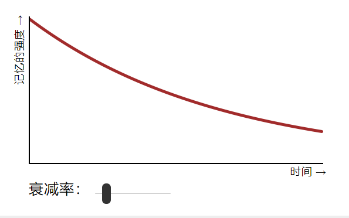
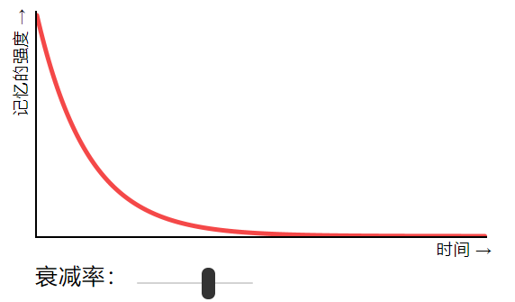

# SuperMemo2

## 间隔重复（spaced repetition）

`reference :https://ncase.me/remember/zh.html`

简单来说，`间隔重复 = 测试 + 时间` 你重复测试自己关于一件事的记忆，用时间隔开复习次数。

### 遗忘曲线

#### 记忆衰退的速率

这是一个可供玩耍的关于遗忘曲线的模拟。 改变记忆衰退的速率。曲线会怎么变化呢？记忆衰退得越慢，曲线就越平缓 ——也就是说，记忆能越持久。

