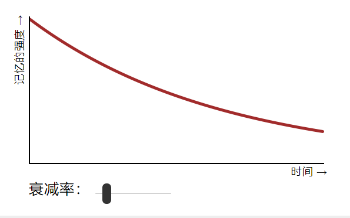
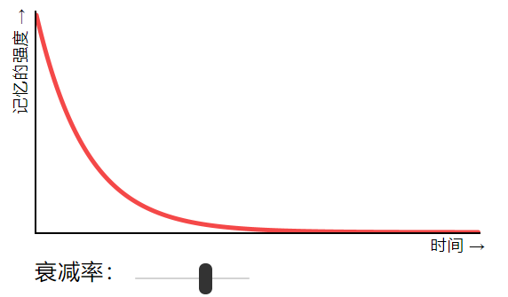

# SuperMemo2


`reference :https://ncase.me/remember/zh.html`

简单来说，`间隔重复 = 测试 + 时间` 你重复测试自己关于一件事的记忆，用时间隔开复习次数。


### 遗忘曲线

#### 记忆衰退的速率





​		这是一个可供玩耍的关于遗忘曲线的模拟。 改变记忆衰退的速率。曲线会怎么变化呢？记忆衰退得越慢，曲线就越平缓 ——也就是说，记忆能越持久。一个人记忆衰减的快慢取决于这个人本身和TA的记忆,但是一般来说，每次你去主动回想，记忆的“衰减速率”就会减慢。 (而不是你被动地去重复阅读)。虽然说回忆练习一停下，你的记忆还是会衰减。单次回想期对记忆有一点促进...但是长期来说，因为记忆的指数型衰减，区区一次回想带不来什么大变化。

​		学习什么东西最好的办法，就是选定时机去回想这件事，让我们假设你效率高，所以你只需要回忆4次。

```
问题： 回想时机的最佳分布方式是什么？ 
递增间隔
```

为什么间隔*必须* 变大？ 因为：每次你在最佳时机带做一次回想， 记忆的衰减率就会放缓，就是说到下次最佳时机带需要*更长* 的时间！


### 间隔重复（spaced repetition）

`你不是必须 要用一个鞋盒去实现间隔重复，但是这样做更有趣。`


首先，把盒子分成七个“等级”。(你可以根据自己喜好分成更少或更多!)

所有新的记忆卡片都从等级1开始。

(如果你是间隔重复的新手，我建议每天从5张新卡片着手。)

当你复习了一张卡片，而且答对了，这张卡片就往上升*一个* 等级。

(如果你到了最后一个等级，恭喜！你的卡片退休了。它走了，去了卡片天堂。)

但是如果你复习了一张卡片，而且答错了...这张卡片必须*一路降回等级1。*

但是如果你复习了一张卡片，而且答错了...这张卡片必须*一路降回等级1。*(如果它是已经在等级1的卡片，好消息：你可以一直测试自己直到你答对，然后把它移到等级2)

但是我们该*什么时候* 复习卡片呢？ 复习的诀窍就是：在Leitner盒里，等级1的卡片每天都复习，等级2两天一次，等级3每*四*天一次，等级4每*八* 天一次，依此类推... 这里面的规律就是：我们把每一个等级的*间隔翻倍* (复习之间的天数)！